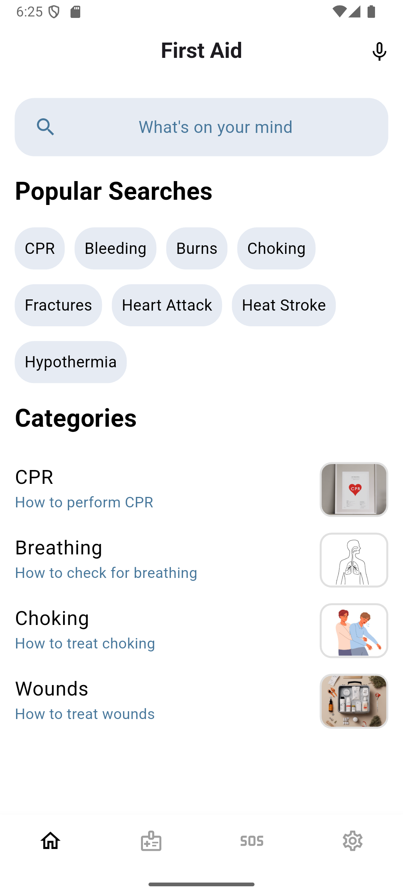
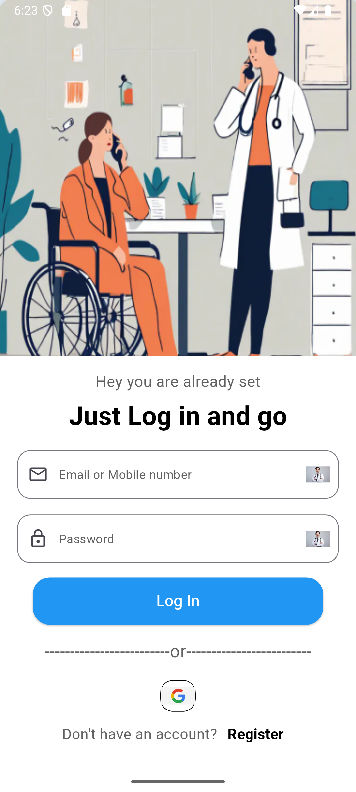
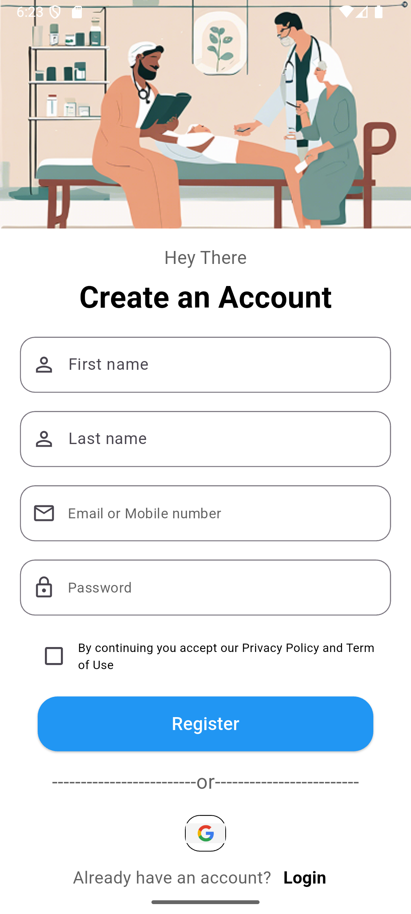
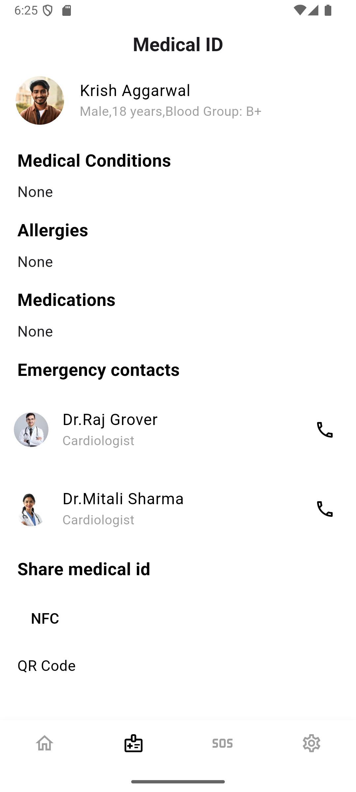
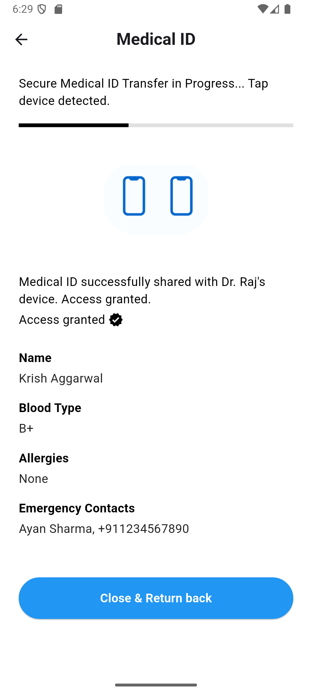
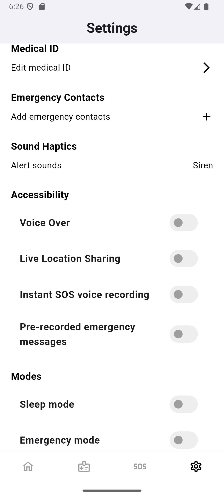
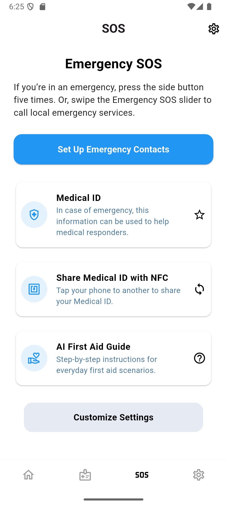
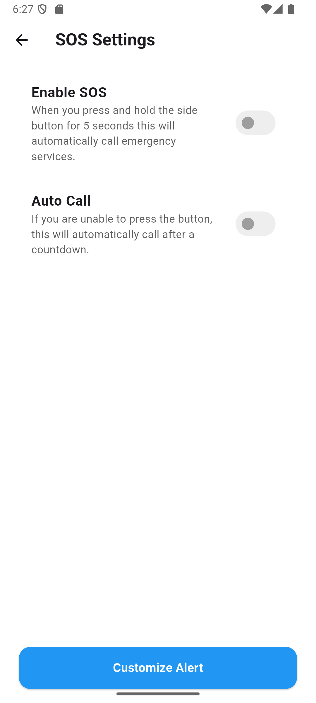
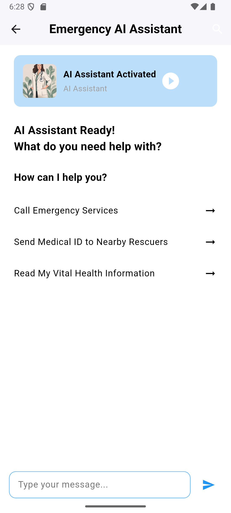

# Emergency Medical App

## Overview
This is an emergency medical app designed to assist users in critical situations by providing quick access to medical information, SOS features, and NFC-based data sharing. The app includes an AI-powered assistant and customizable settings to enhance user experience.

## Features
- **AI Assistant**: Provides support for medical queries.
- **SOS Functionality**: Quick access to emergency contacts and settings.
- **Medical ID**: Stores and shares essential medical details.
- **NFC Sharing**: Enables seamless sharing of medical data via NFC.
- **User Authentication**: Secure login and signup system.
- **Customizable Settings**: Allows users to personalize their experience.

## Screens

### Get Started Page
*Description:* The introductory screen where users are welcomed and guided through the app setup.

### Home Page
*Description:* The main dashboard that provides quick access to essential features such as medical ID, SOS, and AI assistant.

### Login & Signup Pages
*Description:* Screens for user authentication, allowing new users to register and existing users to log in securely.

### Medical ID Page
*Description:* Stores critical medical information, including allergies, blood type, and emergency contacts.

### NFC Sharing Page
*Description:* Enables users to share medical details with others using NFC technology.

### Settings Page
*Description:* Allows users to configure preferences, notifications, and other personalization options.

### SOS Page
*Description:* Provides quick access to emergency contacts and allows users to trigger an SOS alert.

### SOS Settings Page
*Description:* Customization options for SOS alerts, including preferred contacts and emergency message configurations.

### AI Assistant
*Description:* AI-powered chatbot that assists users with medical inquiries and guidance.

## Contributing
Contributions are welcome! Please open an issue or submit a pull request for improvements.

